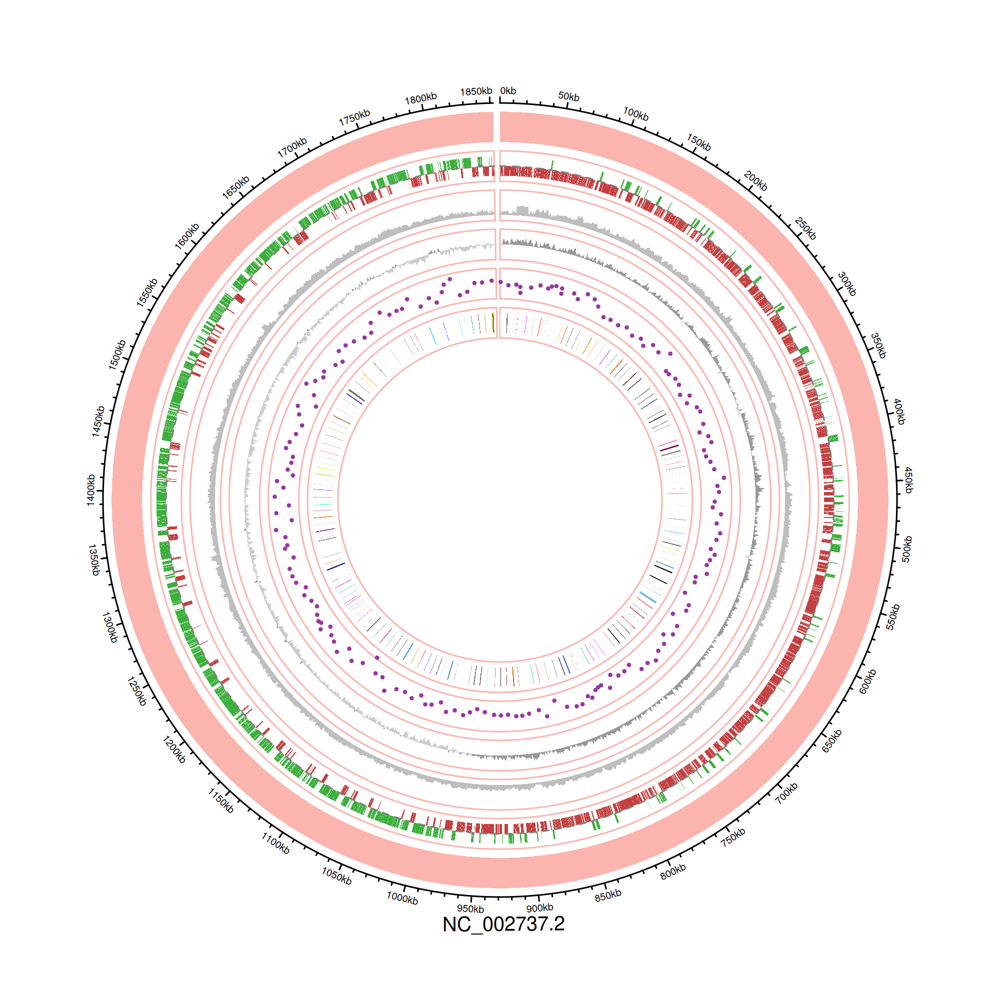

```{r setup, include=FALSE}
knitr::opts_chunk$set(echo = TRUE)
```

## Background

- `circlize` is a powerful R package to plot circular visualizations, so called 'Circos' plots
- Circos plots are a great way to visualize genomic data in a compact and informative way
- typically, they consist of a circular layout with different tracks representing various genomic features, such as annotated genes, GC content and GC skew, and overlaid coverage or interaction data

## Libraries and test data

### Packages

- `circlize` can be installed from within R
- other packages used in this tutorial are `tidyverse`, `GenomicFeatures`, `GenomicRanges`, and `rtracklayer`

```{r, eval = FALSE}
install.packages("circlize")
```

- you can also use conda/mamba, or the pixi to install dependencies in a dedicated environment:

```{bash, eval = FALSE}
pixi init
pixi add r-circlize
...
```

- to render this notebook automatically with the enclosed pixi env, run:

```{bash, eval = FALSE}
pixi run test-notebook
```

- to start an interactive shell with the environment, run:

```{bash, eval = FALSE}
pixi shell --environment circlize
```

- load required libraries

```{r}
suppressPackageStartupMessages({
  library(tidyverse)
  library(circlize)
  library(Biostrings)
  library(GenomicRanges)
  library(GenomicFeatures)
  library(rtracklayer)
})
```

### Import utility functions

- `validate_genomic_input` takes as input two data frames, one with genomic coordinates and one with chromosome information, and checks if coordinates correspond
- `plot_circlize` takes as input two objects, a DNA sequence as `DNAStringSet` and a `GRangesList` with genomic features
- from this data it will automatically plot a circular (genome) map with standard features and tracks
- additional features or data can be plotted as additional tracks, see examples below

```{r}
source("../source/circlize.R")
```

### Import genome annotation

- we import a `*.fasta` and a `*.gff` file corresponding to the same genome assembly
- we truncate the genome seqname(s) such that GFF and FASTA match

```{r}
fasta <- Biostrings::readDNAStringSet("../data/spyogenes_genome.fna")
gff <- rtracklayer::import("../data/spyogenes_genome.gff")

names(fasta) <- stringr::str_split_i(names(fasta), "[ \\|]", 1)
```

### Check annotation data

- the plotting function contains an internal function to validate the genomic coordinates
- however we can also check this up front and make corrections if necessary

```{r}
# genome info
df_chroms <- data.frame(
  name = names(fasta),
  start = rep(0, length(fasta)),
  end = width(fasta)
)

# gene annotation
genes <- gff[gff$type == "gene"]
df_genes <- tibble(
  chr = as.character(seqnames(genes)),
  start = start(genes),
  end = end(genes)
)

# validate if genomic coordinates from annotation and chromosome info correspond
df_genes <- validate_genomic_input(df_genes, df_chroms)
```

- we can also prepare extra data tracks that we supply as a named list including the desired settings
  
```{r}
extra <- list(
  experiment = list(
    data = data.frame(
      chr = "NC_002737.2",
      start = df_genes$start[seq(1, nrow(df_genes), by = 10)],
      end = df_genes$end[seq(1, nrow(df_genes), by = 10)],
      value = rnorm(ceiling(nrow(df_genes) / 10), mean = 10, sd = 5)
    ),
    type = "points",
    color = "#96389f",
    height = 0.07,
    ylim = c(0, 20)
  )
)

extra[["experiment2"]] <- list(
  data = data.frame(
    chr = "NC_002737.2",
    start = df_genes$start[seq(1, nrow(df_genes), by = 10)],
    end = df_genes$end[seq(1, nrow(df_genes), by = 10)],
    value = rep(1, ceiling(nrow(df_genes) / 10))
  ),
  type = "rect",
  color = sample(colors(), ceiling(nrow(df_genes) / 10))
)
```

### Plot Circos plot and save to disk

- use PNG to not get extremely large figures as can happen with vector graphics like PDF or SVG
- plotting can take a while as there is a lot of information

```{r, message = FALSE, warning = FALSE, results = "hide"}
png("../output/circlize.png", width = 2000, height = 2000, res = 300)
plot_circlize(fasta, gff, extra = extra)
dev.off()
```

```{r, echo = FALSE}
# display PNG file here

```